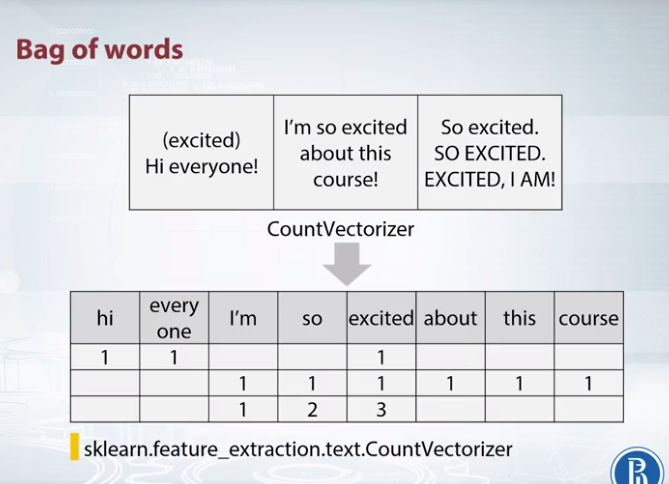
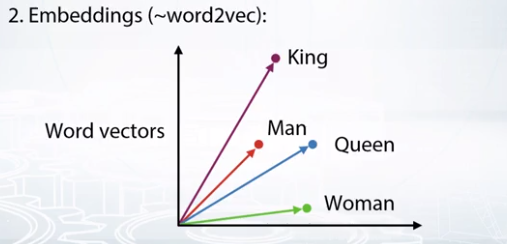
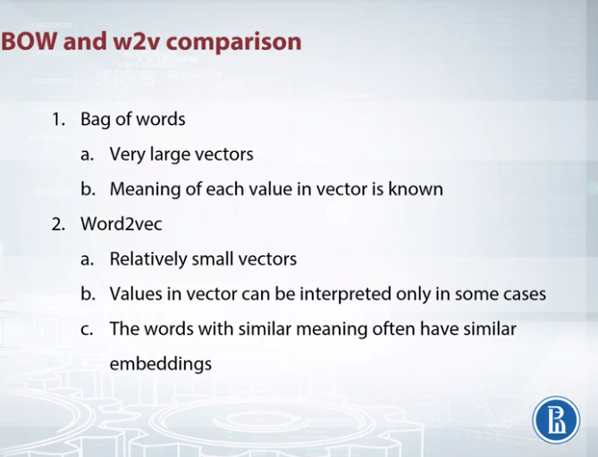
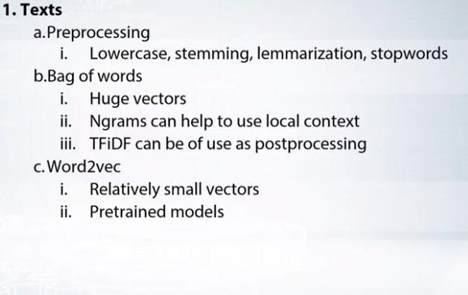

# Extract Features from Text and Image
## Text Feature Extraction:
### text->vector
- Bag of Words 
 
Here we create new column for each unique word from the data, then we simply count number of occurences for each word, and place this value in the appropriate column. After applying the separation to each row, we will have usual dataframe of samples and features. In a sklearn, this can be done with CountVectorizer. 
To make out why we need post-processing let's remember that some models like kNN, like neural regression, and neural networks, depend on scaling of features. So the main goal of post-processing here is to make samples more comparable on one side, and on the other, boost more important features while decreasing the scale of useless ones.
- Embeddings(~word2vec)
 
 It converts each word to some vector in some sophisticated space, which usually have several hundred dimensions. To learn the word embedding, Word2vec uses nearby words. Basically, different words, which often are used in the same context, will be very close in these vectoring representation, which, of course, will benefit our models. Furthermore, there are some prominent examples showing that we can apply basic operations like addition and subtraction on these vectors and expect results of such operations to be interpretable.
 example: if we do 
 [(king - man) + woman]
 result will be queen

For word embeddings
- Word2Vec
- glove
- FastText

For Sentence 
- Doc2Vec

if we need to derive vectors not for words but for sentences. Here, we may take different approaches. For example,
- we can calculate mean or sum of words vectors 
- go with special models like Doc2vec. 

Choice all the way to proceed here depends on and particular situation. Usually, it is better to check both approaches and select the best. 

### Difference between bag of words and Word2Vec:

## Feature Extraction from texts

