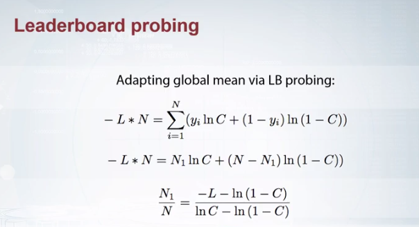

# Data Leakage
Sometimes some unexpected data allows to predict unrealstically good. Data Leasks are unintentional errors/accidents.

## Leaks in time series
In competition check train, public, private data split and if one of them are not in time there's a data leak. In such case, unrealistic features like prices next week will be the most important. 

## Unexpected Information 
- **Meta data**: Sometimes from images there can be a feature like type of camera, taken time etc. But it can also be changed by the organizer before the contest.

- **Information in IDs**:  Most of the time ids are generated randomly so id is redundant for training but sometimes ids can be hashed result of some feature which may contain valueable information for the model so in that case adding id as a feature to the model can boost the accuracy.

- **Row Order**: Sometimes adding row numbers or relative number can boost the result. 

## Leaderboard Probing
There are two kind of leaderboard probing.
- Extract all the ground truth from public part of the leaderboard.

