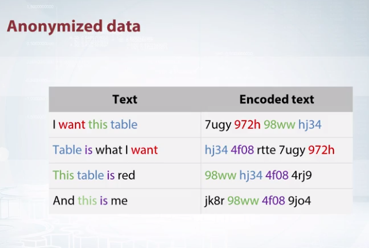
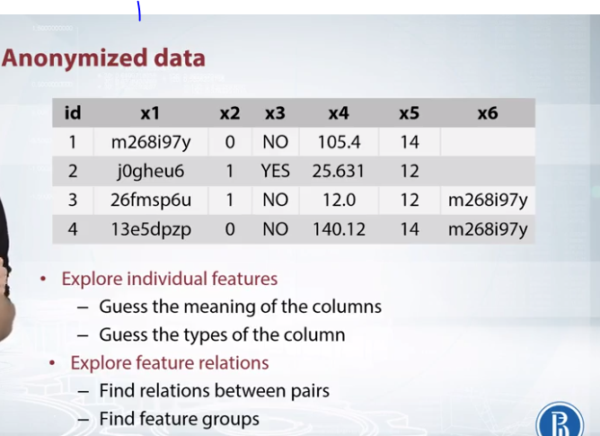

# Anonymized Data
If a company wants someone to classify its document, but doesn't want to reveal the document's content. It can replace all the word occurrences with hash values of those words
  

## How to handle?

## **Need to watch the [Tutorial](https://www.coursera.org/learn/competitive-data-science/lecture/qJHOb/exploring-anonymized-data) again.**

# Visualization 
**[Tutorial](https://www.coursera.org/learn/competitive-data-science/lecture/zoIx3/visualizations)**