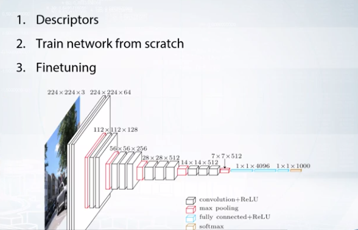
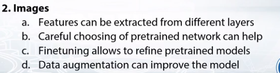

# Image to Vector Representation
**Convolutional Neural Network** can give a compressed representation for an **Image**.  

 
Need to focus on **Finetuning** , **Augmentation**

## Feature Extraction from Images 
