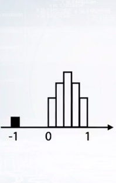
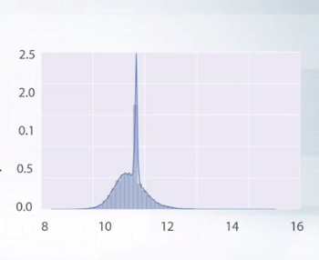

# Handeling Missing Values
Missing value can contain:
- Empty String
- Not numbers
- Outliers

## Identifying Hidden NaNs
### -1 is a  missing value in the following figure

 
 This variable has uniform distribution between 0 and 1. And that it has small peak of -1 values. So if there are no not numbers there, we can assume that they were replaced by -1. Or the feature distribution plot can look like the second figure.
 
 
   
  In this figure x axis has lock scale. In this case, not a numbers probably were few by features mean value.

  ## Fillna approaches
 - -999, -1 etc: is useful in a way that it gives three possibility to take missing value into separate category. The downside of this is that performance of linear networks can suffer.
 - mean, median:  usually beneficial for simple linear models and neural networks. But again for trees it can be harder to select object which had missing values in the first place.
 - Reconstructive value.

 If there is a missing value in a row can be addressed by adding new feature **isnull** indicating which row has missing values for a feature. But the problem is it will double the number of columns in the dataset.

## Reconstructing Missing Value
Some Common Approaches are
-  Sometimes we can treat outliers as missing values. For example, if we have some easy classification task with songs which are thought to be composed even before ancient Rome, or maybe the year 2025. We can try to treat these outliers as missing values.
- For categorical features, sometimes it can be beneficial to change the missing values or categories which present in the test data but do not present in the train data. The intention for doing so appeals to the fact that the model which didn't have that category in the train data will eventually treat it randomly. Here and of categorical features can be of help. As we already discussed in our course, we can change categories to its frequencies and thus to it categories was in before based on their frequency.

[Tutorial Link](https://www.coursera.org/learn/competitive-data-science/lecture/buVh8/handling-missing-values)